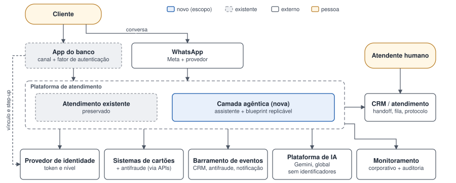
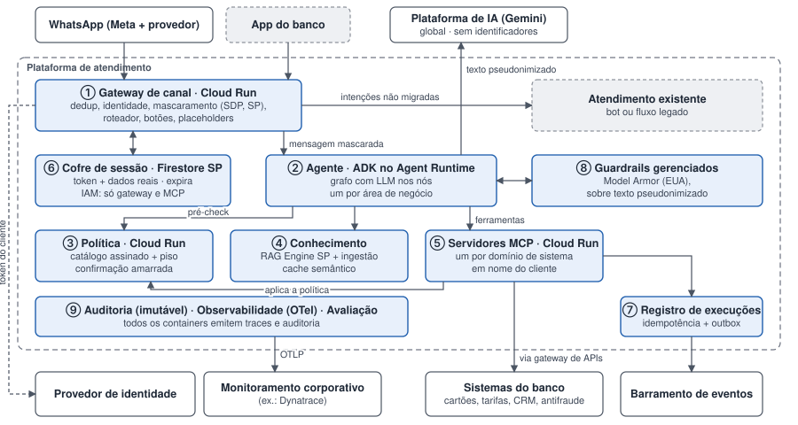
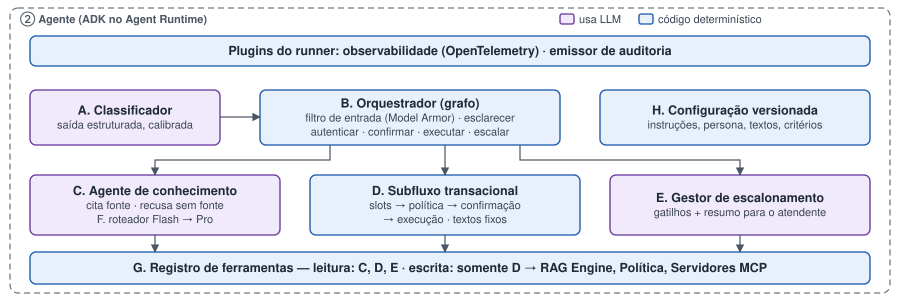
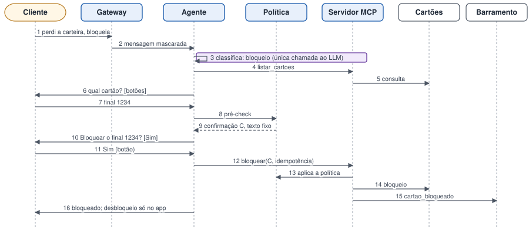

# Arquitetura de referência

Assistente agêntico para o atendimento de um banco de varejo fictício, o **Banco Exemplo**, no WhatsApp e no
app. Ele responde com base no conhecimento oficial do banco e executa transações simples. A solução é
desenhada como **blueprint**: o que é comum a qualquer área vira plataforma; o que é de domínio vira
configuração.

> **Status:** arquitetura de referência completa; protótipo em construção. A seção
> [Implementado × proposto](#implementado--proposto) diz o que já existe em código.

## Tese

**"O LLM interpreta, a regra autoriza."** O modelo entende o cliente, conduz a conversa e redige respostas.
Se uma ação pode ser executada, com quais parâmetros e com qual autenticação, quem decide é código
determinístico, testável e auditável. A autonomia do modelo fica onde ela se paga.

## Tipos de pedido

| Tipo | Exemplo | Caminho | Exige |
|---|---|---|---|
| Informação geral | "Qual a anuidade do cartão?" | Busca na base, com citação | Nada |
| Consulta | "Qual meu limite?" | Ferramenta de leitura | Número vinculado |
| Transação | "Bloqueia meu cartão" | Política → confirmação → escrita | Autenticação conforme o risco |
| Fora de escopo | "Qual ação devo comprar?" | Recusa educada | — |

O escalonamento para humano não é um tipo: é uma saída transversal (pedido do cliente, negativa da política,
falta de fonte, falhas repetidas, tema sensível, frustração).

**A decisão entre responder e executar não é do modelo:** (1) o LLM classifica numa intenção do catálogo; (2)
o **catálogo** define tipo, risco, autenticação, limites e fase liberada, e nega o que não conhece; (3) a
**política** decide; (4) a política gera uma **confirmação amarrada aos parâmetros** (texto fixo, uso único,
validade curta), o cliente confirma por botão e o executor só aceita o que bate com ela.

## Contexto (C4, nível 1)

A camada agêntica convive com o atendimento existente, que é preservado, e o tráfego migra intenção por
intenção. O app é canal e fator de autenticação. A identidade chega pelo provedor de identidade, nunca pelo
texto da conversa. A plataforma de IA é sistema externo por ser o único ponto em que dado sai da região (endpoint
global), e por isso recebe só texto pseudonimizado.

## Containers (C4, nível 2)

- **Plataforma compartilhada:** gateway de canal, política, guardrails, auditoria, observabilidade.
  **Templates:** agente e base de conhecimento por área de negócio; servidor MCP por domínio de sistema.
- **Política consultada duas vezes:** pelo agente, para conduzir a conversa, e pelo servidor MCP, que barra na
  execução. Vale a do executor.
- **Cofre de sessão:** token do cliente e dados reais num armazenamento dedicado, criptografado e com
  expiração, acessível só ao gateway e ao servidor MCP. O agente não tem acesso; a identidade chega ao MCP
  pelo contexto autenticado da requisição, nunca por parâmetro escolhido pelo LLM.
- **Guardrails em dois pontos:** mascaramento no gateway, na região dos dados, antes do agente; filtro de
  injection e conteúdo no agente, sobre texto já pseudonimizado.
- **Integrações** só via servidor MCP (pelo gateway de APIs corporativo), gateway de canal ou barramento de
  eventos. O agente não chama APIs.

## Componentes do agente (C4, nível 3)

Grafo determinístico com LLM dentro dos nós. Roxo: componentes que usam LLM (classificador, conhecimento,
escalonamento). Azul: código. Ferramentas de escrita existem só no subfluxo transacional.

## Fluxo de referência: bloqueio de cartão

É o caminho mais completo; os demais tipos são recortes dele. O LLM é chamado **uma vez** (classificar). Dados
do cartão, decisão e execução são código. Sem resposta do sistema, o agente **nunca afirma sucesso**: consulta o
estado, abre protocolo e reconcilia depois.

## Fluxo de referência: pergunta de conhecimento

Classificação (LLM) → cache semântico para perguntas repetidas (mesma intenção e entidades, documentos
vigentes; consulta e transação nunca são cacheadas) → busca em documentos vigentes e com dono, com valores
vindos da tabela oficial → resposta com citação por afirmação (LLM) → verificação de fundamentação; se falhar
duas vezes, recusa e oferece humano → filtro de saída. Até três chamadas ao modelo por turno: é o fluxo de
maior risco e maior custo.

## Autenticação progressiva

| Nível | Como se obtém | Libera |
|---|---|---|
| 0 | — | Informação geral |
| 1 | Número vinculado pelo app | Consultas |
| 2 | Autorização no app + sessão curta | Transações de baixo risco |
| 3 | Biometria no app para a operação | Transações de risco médio |

A exigência segue o **risco da ação**: o bloqueio temporário, reversível, exige nível 1 e confirmação; o
desbloqueio, nível 3 e só no app.

## Segurança e dados

- **Defesa em profundidade:** negação por padrão, autenticação por risco, confirmação amarrada, política no
  executor, escrita fora do contexto do LLM, idempotência, antifraude. O filtro de injection reduz o volume de
  ataques; a garantia vem das camadas determinísticas.
- **O LLM redige; quem preenche os valores do cliente é código.** Identidade nunca vai ao modelo; o que o
  cliente digita vira marcador reversível; retornos de ferramentas usam placeholders. Número de cartão digitado
  é descartado. O texto da conversa chega **pseudonimizado**, o que reduz o risco mas continua sendo dado
  pessoal.
- **Catálogo como ponto de controle:** configuração versionada, alterada com segregação de funções, publicada
  assinada; um piso de invariantes em código que nenhuma configuração sobrescreve.

## Avaliação e observabilidade

Golden set, red team e regressão em quatro níveis (recuperação, ingestão, resposta final, contínuo); zero
ataques com escrita ou vazamento; juiz LLM calibrado contra rótulos humanos. Online: qualidade, segurança e
recontato em 24–72h. Traces em OpenTelemetry com um span por passo, coletor distribuindo para os destinos de
monitoramento, correlação com a trilha de auditoria.

## Implantação

| Componente | Onde roda |
|---|---|
| Gateway, política, servidores MCP | Cloud Run |
| Agente | ADK no Agent Runtime |
| Conhecimento | RAG Engine |
| Cofre, registro de execuções, cache | Firestore (bancos separados) |
| Auditoria | BigQuery + armazenamento imutável |
| Modelos | Gemini Flash (padrão) e Gemini Pro (por critério) |

## Implementado × proposto

| Componente | Status |
|---|---|
| Arquitetura, decisões e diagramas | ✅ Documentado |
| Scaffold do agente (ADK + agents-cli) | ✅ Criado |
| Catálogo de intenções e piso de invariantes | ✅ Implementado (P1): `config/catalogo/`, `app/nucleo/catalogo.py`; assinatura é mock |
| Testes unitários no CI (GitHub Actions) | ✅ Implementado: `.github/workflows/testes.yml`, a cada push e PR |
| Pipeline de publicação do catálogo (assinatura, validação entre versões) | 📋 Proposto; hoje só existe a função `validar_publicacao` |
| Política e confirmação amarrada | ✅ Implementado (P2): `app/nucleo/politica.py`, `app/nucleo/confirmacao.py`; confirmações em memória (mock); fase "assistido" tratada como "autonomo" |
| Registro de execuções e idempotência | ✅ Implementado (P2): `app/nucleo/execucoes.py`; chave = id da confirmação; em memória (mock) |
| Servidor MCP de cartões | ✅ Implementado (P2): `app/mcp_cartoes/`, SDK MCP 1.x real sobre sistema de cartões mock com timeout simulado; sessão e confirmação pelo `_meta` |
| Cofre de sessão | ✅ Mock (P2): `app/nucleo/sessao.py`, em memória, sem expiração |
| Agente integrado ao núcleo (grafo do ADK) | ✅ Implementado: `app/agent.py`, `app/orquestrador/`; LLM só em nós sem ferramentas (classificador e, no conhecimento, redator e revisor); fluxos de bloqueio, consulta de limite e lista de cartões; negações com texto fixo. Adequações: confirmação por "SIM" digitado (em produção, botão), sessão de demonstração (em produção, gateway), servidor MCP no mesmo processo. [Evidência no playground](evidencias/playground-2026-09-29.md) |
| Idempotência de negócio (não oferecer bloqueio de cartão já bloqueado) | ✅ Implementado: recusa `cartao_ja_bloqueado` no executor (`app/mcp_cartoes/servidor.py`), pela situação no sistema mock; pré-check no agente antes da confirmação e texto fixo também para a corrida entre o pré-check e o "SIM" |
| Transporte HTTP autenticado do MCP, anotações de leitura/escrita, outbox de eventos (D7) | 📋 Proposto |
| Conhecimento com citação e valores da tabela oficial | ✅ Implementado (P3): corpus fictício com dono, versão e vigência e tabela de valores (`config/conhecimento/`); busca, redator (Flash) e revisor (Pro) sem ferramentas; verificação de fundamentação e preenchimento de valores em código (`app/conhecimento/`, `app/orquestrador/fluxo.py`). Mock: busca lexical local; tabela em arquivo (em produção, ferramenta de leitura do sistema de produtos). A verificação garante procedência, não relevância. [Evidência no playground](evidencias/playground-2026-10-01.md) |
| Busca semântica (RAG Engine) | ⏳ Pendente (P3.6): adaptador atrás da interface `Buscador`; custo fixo, exige aprovação. Caso de comparação: "quanto custa bloquear o cartão?" (achado 2 da evidência de 1º/out) |
| Pipeline de publicação do conhecimento (autoria em Word/SharePoint, aprovação, validação, gate de avaliação) | 📋 Proposto; as regras de validação já existem em `app/conhecimento/corpus.py` |
| Cache semântico | 📋 Proposto |
| Avaliação offline com modelo real | ✅ Implementado (P5): 23 casos em cinco grupos (`tests/eval/datasets/`), métricas de código e juiz LLM de fidelidade calibrado contra rótulos humanos (`tests/eval/`); três rodadas com antes e depois. [Evidência](evidencias/avaliacao-2026-10-05.md) |
| Avaliação contínua no CI | ✅ Implementado: `.github/workflows/avaliacao.yml`, no `main` (quando agente, corpus ou avaliação mudam) e sob demanda; acesso ao Google Cloud por federação de identidade, sem chave, restrito ao id do repositório e ao `main`; resumo na página da execução; alerta de orçamento. Informativa, sem gate |
| Gate de qualidade no CI | 📋 Proposto: depende de casos `infiel` e `nao_responde` no conjunto e de execuções estáveis |
| Red team ampliado, casos de vários turnos, comparação de temperatura | 📋 Proposto |
| Mascaramento de dados pessoais antes do LLM | ✅ Implementado (P4.1): plugin do ADK (`app/guardrails/`) com Sensitive Data Protection no endpoint regional `southamerica-east1` e regras locais com dígito verificador; CPF, cartão, e-mail, telefone, nome e endereço viram marcadores; número completo de cartão vira aviso fixo, sem LLM. Medido no CI (grupo privacidade, 4/4). [Evidência](evidencias/mascaramento-2026-10-05.md) |
| Trilha de auditoria | ✅ Implementado (P4.2): plugin do ADK (`app/auditoria/`) com um registro por turno, sem dado pessoal em claro; cadeia de hashes por sessão; registro completo no Cloud Storage (retenção travada, objeto gravado uma vez) e metadados no BigQuery, ambos em `southamerica-east1`; verificador que confere a cadeia e o bucket contra o BigQuery. Retenção de 1 dia no laboratório (em produção, o prazo regulatório). [Evidência](evidencias/auditoria-2026-10-06.md) |
| Escalonamento com resumo | ✅ Implementado (P4.3): pedido explícito (campo `pede_atendente` do classificador, separado da intenção), aceite da oferta só por "sim" e três falhas seguidas; resumo para o atendente montado por código a partir do histórico da auditoria; chamado com protocolo `ATD-` numa fila local (mock); depois do encaminhamento o agente não responde por cima. [Evidência](evidencias/escalonamento-2026-10-06.md) |
| Integração com a plataforma de atendimento humano; gatilhos por tema sensível e frustração | 📋 Proposto (exigem interpretação: classificador próprio e avaliação) |
| Filtro de entrada (Model Armor) | ✅ Implementado (P4.4): Model Armor em `us-central1` sobre o texto já mascarado, só antes de um LLM; injeção no limite baixo; mensagem barrada recebe texto fixo, sem LLM, e não conta como falha; se o serviço falhar, a mensagem segue e a falha fica na auditoria. Medido no CI (manipulação 5/5, nenhum falso positivo). [Evidência](evidencias/model-armor-2026-10-07.md) |
| Prazo nas chamadas ao LLM | ✅ Implementado: prazo e uma repetição por chamada; turno sem resposta fica na auditoria como `interrompido` |
| Observabilidade | 📋 Proposto (P6) |

Decisões e alternativas descartadas: [decisoes.md](decisoes.md). Plano de execução:
[plano-prototipo.md](plano-prototipo.md).
